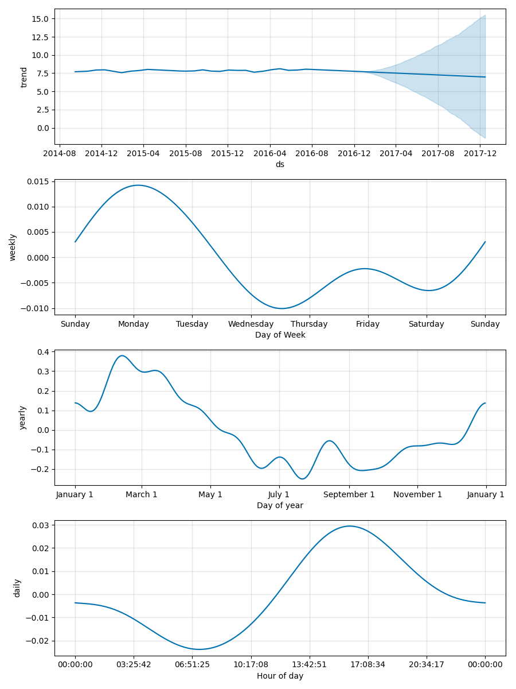

# BB3AB-Real-Time-Multiparameter-Anomaly-Identification-and-Detection

## 1. Introduction
To safeguard public health and protect the environment, online and continuous water quality monitoring is crucial for the water sector. Regulatory compliance also necessitates deploying real-time monitoring solutions, which can capture the evolving states of a particular river or water network and provide online information on diverse events (e.g., pollution, CSO, etc.). This work introduces a comprehensive end-to-end (E2E) framework that combines online data ingestion and ascertains real-time anomaly detection for water utilities in the UK.  Online multiparameter time-series data can originate from various sources such as SCADA systems, IoT-based sensors, or sondes deployed in water utilities. These platforms continuously collect environmental data across multiple parameters, enabling real-time monitoring of water quality. A key challenge in this context is detecting anomalies—sudden or unusual changes in the data that may indicate pollution events, sensor faults, or operational issues.  Once detected, it is equally important to categorize these anomalies to distinguish between natural variations, technical errors, and potential threats to water safety. Therefore, our approach focuses on detecting anomalies in continuous water quality monitoring data followed by categorizing anomalies in continuous monitoring data. We capture this heterogeneous time series data and classify anomalies incrementally with respect to time. Second, this approach is scalable and can ingest multiparameter time series data, as required. The model also learns critical features from historical observations to understand the past behavior of parameters to improve accuracy. For validation, the system successfully detected a live sensor fouling event, indicated by a decline in Turbidity and conductivity.    This method strengthens real-time surveillance and supports water utilities in making prompt, informed decisions. 

## 2. Dependencies
The model is developed using Python and related dependencies. To run the model, you must install the valid libraries i.e [pandas](https://www.google.com), [matplotlib](https://matplotlib.org/), [prophet](https://facebook.github.io/prophet/), and [animation](https://matplotlib.org/stable/users/explain/animations/animations.html). 

## 3. Summary of data exploration:

A range of selected parameters were chosen taking into account values of interest and those that fall under Section 82 regulations and include pH, dissolved oxygen, turbidity, conductivity, temperature, chlorophyll (cphyll), ammonium, and saturated dissolved oxygen percentage. These readings provide a detailed temporal record of water quality conditions.  

## 4. Directory Structure
    OpenSlurryTanksDetectionModel/
    ├── README.md                 # Project overview and usage instructions
    ├── Multiparameter.py         # Model for multi parameter
    ├── SingleParameter.py        # Model for sinle parameter
    ├── MODEL_CARD.md             # Model details
    ├── INSTALL.md                # Step-by-step installation instructions
    ├── CONTRIBUTING.md           # Contribution guidelines (internal use only)
    ├── CHANGELOG.md              # List of changes and improvements made to the project
    ├── requirements.txt          #python libraries required 
    └── LICENSE                   # Licensing information and usage rights

## 3. Online Anomly Detection From Single Parameter Sensor Data Stream

### Instructions of running RolA 

## 4. Online Anomly Detection From Multi Parameter Sensor Data Stream
IQR model

# License and Disclaimers

The Colab notebooks and the associated code are licensed under MIT 4.0. You may obtain a copy of the License at: [MIT](https://opensource.org/license/mit)

THE SOFTWARE IS PROVIDED “AS IS”, WITHOUT WARRANTY OF ANY KIND, EXPRESS OR IMPLIED, INCLUDING BUT NOT LIMITED TO THE WARRANTIES OF MERCHANTABILITY, FITNESS FOR A PARTICULAR PURPOSE AND NONINFRINGEMENT. IN NO EVENT SHALL THE AUTHORS OR COPYRIGHT HOLDERS BE LIABLE FOR ANY CLAIM, DAMAGES OR OTHER LIABILITY, WHETHER IN AN ACTION OF CONTRACT, TORT OR OTHERWISE, ARISING FROM, OUT OF OR IN CONNECTION WITH THE SOFTWARE OR THE USE OR OTHER DEALINGS IN THE SOFTWARE.

# Citations

# Acknowledgements

<dl>
  <dt>Definition list</dt>
  <dd>Is something people use sometimes.</dd>

  <dt>Markdown in HTML</dt>
  <dd>Does *not* work **very** well. Use HTML <em>tags</em>.</dd>
</dl>

## Advantages:

Real-Time Anomalies Detection and Classification 

Multiparameter Water Quality Anomaly Detection 

This project visualizes and detects anomalies in real-time sensor data for multiple water quality parameters, such as:**

Dissolved Oxygen (DO) 

pH 

Turbidity 

Ammonia 

Electrical Conductivity (EC) 

Anomalies are detected using the IQR (Interquartile Range) method and visualized in a dynamic Matplotlib animation. 

## Files

main_plot.py: Main Python script for real-time visualization and anomaly detection. 

anomaly_logged_data_*.csv: Auto-generated log files of detected anomalies during visualization. 

###Features

Real-time animated plotting of multiple parameters. 

Outlier detection using statistical thresholds (IQR). 

Dynamic background color changes based on thresholds. 

Saves anomaly data automatically on window close. 

Optional export of animation to .mp4 using FFmpeg. 

### Requirements

Install required Python packages: 

pip install pandas matplotlib 

To enable video export, download and install FFmpeg, and update the path in the script: 

matplotlib.rcParams['animation.ffmpeg_path'] = "path_to_ffmpeg" 

**Usage**

index (timestamp or row number) 

value (sensor reading) 

Run the script: 

python main_plot.py 

When the plot window is closed, anomaly logs will be saved to CSV. 

**Notes**

Current anomaly detection is univariate (IQR). You can extend it using Mahalanobis distance for multivariate detection. 

For larger datasets, consider optimizing performance or using data streaming libraries. 

**Sample Output** 

Real-time animated chart with colored lines for each parameter and red markers for anomalies. 

**Future Enhancements**

Mahalanobis-based multivariate anomaly detection. 

Dashboard integration (e.g., using Dash or Plotly). 

Sensor calibration checks and alerting system. 

 
